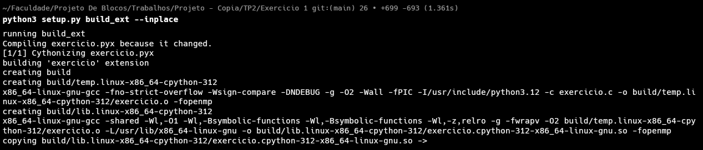
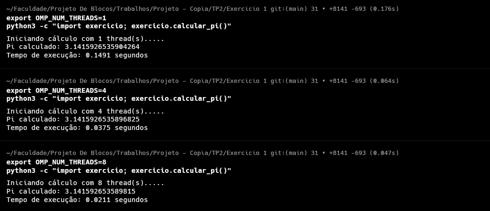

Como o senhor disse que poderia usar o Cython vou usar. gostei da forma que o Tiado ensinou.
Buid

<br>
threads
usei:
```bash 
export OMP_NUM_THREADS=[QUANTIDADE DE THREADS]
python3 -c "import exercicio; exercicio.calcular_pi()"
```


Como esperado o uso de paralelismo reduzi drasticamente o tempo de execução ao dividr a carga para multiplas threads e é uma grande prova do OpenMP na otimização ed calculo. 