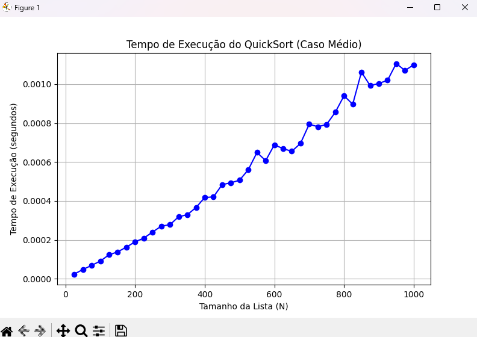

 
To usando a lib "matplotlib.pyplot" pro gráfico pq acho que facilita muito a vida.
 
Acho que pro relatorio n tem muito oq falar pois acho que fiz bons comentarios.
Fiz essa escolha de bivo (ruim) para demonstrar o erro e que ter um valor fixo n pe uma boa coisa e que analisando o grafico podemos analisar uma curva de crescimento linear (superlinear)