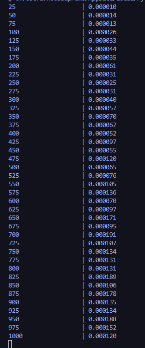

 
To usando a lib "matplotlib.pyplot" pro gráfico pq acho que facilita muito a vida.
O gra´fico prova a mesma terioa o QuickSelect é tb sensível a escolhja do pivo e a sorte de achar o elemento rapidamente .O crescimento do lenar (O(n)).