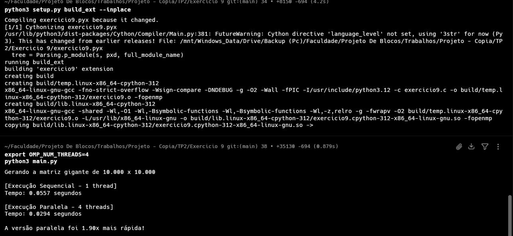

Como o senhor disse que poderia usar o Cython vou usar. gostei da forma que o Tiado ensinou.
Buid
usei:
```bash 
export OMP_NUM_THREADS=4
python3 main.py
```


O paralelismo reduziu desticamente o tempo de execução ao dividr o a carga de trabalho no processamento da matrix grande.